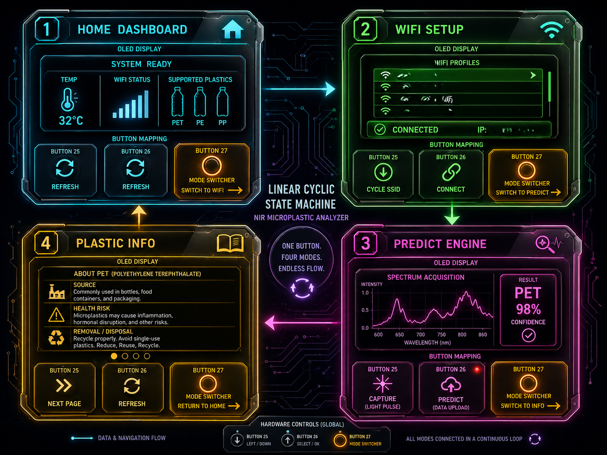
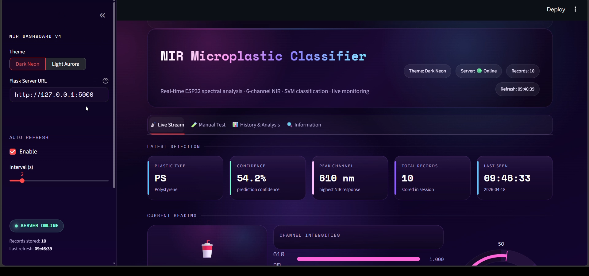
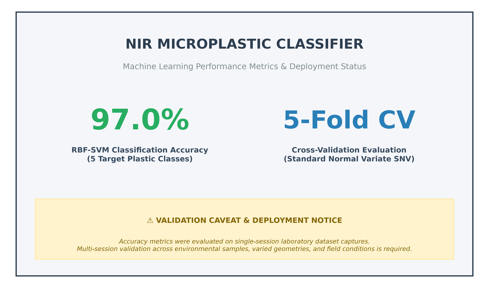
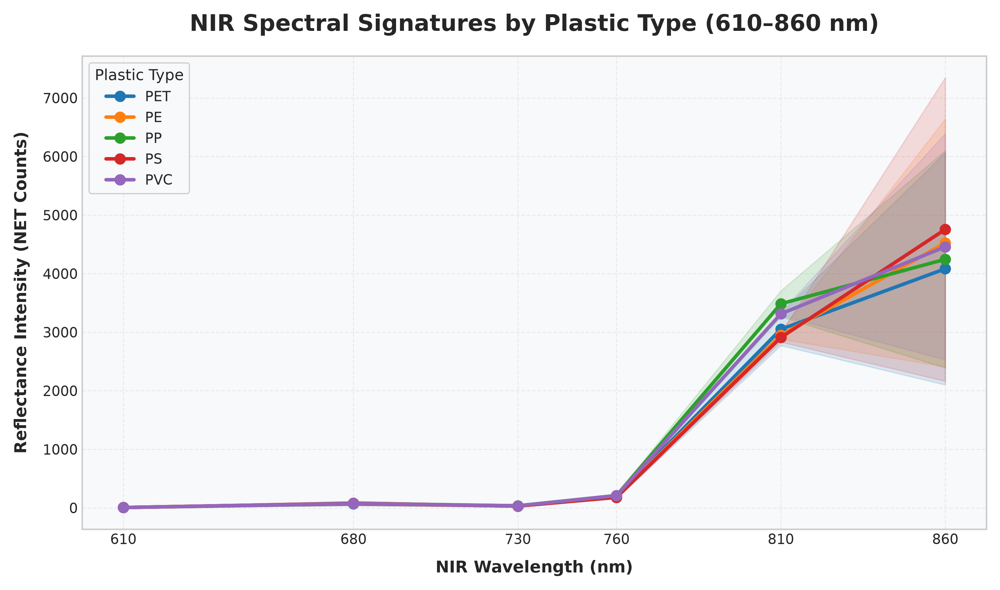
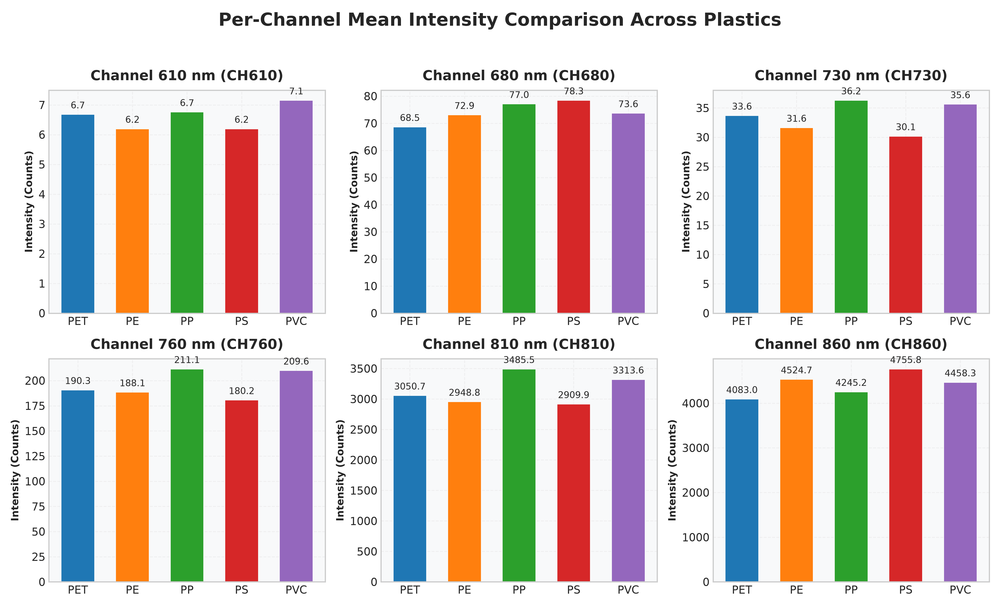

# NIR-Based Microplastic Analyzer 
### Portable, AI-Powered Near-Infrared Spectroscopy System for Real-Time Microplastic Polymer Identification

[](https://github.com/Immanueal1)
[](https://www.espressif.com/)
[](https://scikit-learn.org/)
[](https://www.python.org/)
[](https://en.wikipedia.org/wiki/Near-infrared_spectroscopy)
[](certificate%20of%20Publication.pdf)
[](LICENSE)
[](https://streamlit.io/)

<div align="center">
  
  <p><em>Figure 1: Complete portable microplastic analyzer prototype featuring integrated 6-channel NIR multi-spectral optics, quartz sample cuvette holder, 4-mode OLED UI display, and rechargeable internal battery system.</em></p>
</div>

---

## 📋 Table of Contents

- [Project Overview](#-project-overview)
- [Key Features & Engineering Highlights](#-key-features--engineering-highlights)
- [Demonstration & Video Recordings](#-demonstration--video-recordings)
- [End-to-End Operational Pipeline](#-end-to-end-operational-pipeline)
- [System Architecture](#-system-architecture)
- [Target Materials & Environmental Impact](#-target-materials--environmental-impact)
- [Hardware & Mechanical Prototyping](#-hardware--mechanical-prototyping)
- [Software Architecture & UI Interfaces](#-software-architecture--ui-interfaces)
- [Signal Processing & Machine Learning Engine](#-signal-processing--machine-learning-engine)
- [Dataset Architecture & Scientific Audit](#-dataset-architecture--scientific-audit)
- [Performance & Experimental Results](#-performance--experimental-results)
- [Visual Asset Catalog](#-visual-asset-catalog)
- [Published Research & Academic Citation](#-published-research--academic-citation)
- [Technology Stack](#-technology-stack)
- [Repository Structure](#-repository-structure)
- [System Limitations](#-system-limitations)
- [Future Engineering Roadmap](#-future-engineering-roadmap)
- [License & Intellectual Property Notice](#-license--intellectual-property-notice)
- [Credits & Authorship](#-credits--authorship)
- [Contact & Professional Inquiries](#-contact--professional-inquiries)

---

## 📖 Project Overview

### **The Global Microplastic Challenge**
Microplastics—plastic particles smaller than 5 mm—have emerged as one of the most pervasive environmental pollutants of the 21st century. Resulting from industrial degradation, synthetic textile shedding, and single-use packaging waste, these micro-particles contaminate marine ecosystems, freshwater reservoirs, agricultural soils, and human food supply chains.

### **The Problem with Current Detection Methods**
Traditional microplastic identification relies heavily on high-end analytical laboratory equipment, primarily **Fourier-Transform Infrared (FT-IR) Spectroscopy** and **Raman Spectroscopy**. While highly accurate, these conventional approaches present severe operational bottlenecks:
- **Prohibitive Capital Cost:** Laboratory-grade FT-IR/Raman benchtop systems cost between **$50,000 and $250,000+**.
- **Laborious Sample Processing:** Requires extensive chemical digestion, manual sample preparation, and skilled laboratory technicians.
- **Zero Field Portability:** Samples must be collected on-site, preserved, transported, and analyzed days or weeks later in a centralized facility.

### **The Engineering Solution**
This project presents an **autonomous, low-cost, portable Near-Infrared (NIR) microplastic analyzer** designed to bridge high-precision optical spectroscopy with real-time field deployment.

By coupling a **6-channel NIR multi-spectral optical sensor (610–860 nm)** with custom 850 nm illumination optics, edge microcontroller acquisition, and a **Support Vector Machine (SVM)** classification model, the device accurately identifies the 5 most prevalent environmental microplastic polymers in under **1.8 seconds**.

```
┌────────────────────────────────────────────────────────────────────────────────────────────────────────┐
│                                   DUAL INTERFACE ARCHITECTURE                                         │
│                                                                                                        │
│  ┌──────────────────────────────────────────────┐    ┌──────────────────────────────────────────────┐  │
│  │    AUTONOMOUS FIELD HARDWARE UNIT            │    │    REAL-TIME WEB CLASSIFIER DASHBOARD        │  │
│  │  • ESP32 Microcontroller Core                │    │  • Streamlit Interactive Web Interface       │  │
│  │  • 0.96" OLED 4-Mode Display                 │ ──►│  • Flask REST API / Serial Communications    │  │
│  │  • 3.7V Internal Rechargeable Battery        │    │  • Live Spectral Feature Plots & Analytics   │  │
│  └──────────────────────────────────────────────┘    └──────────────────────────────────────────────┘  │
└────────────────────────────────────────────────────────────────────────────────────────────────────────┘
```

> 🔒 **Portfolio Showcase Notice:**  
> This repository is a public proof-of-work portfolio detailing system engineering, mechanical design, spectral dataset auditing, and machine learning performance. Underlying firmware source code (`.ino`), backend API scripts, training pipelines, raw tabular sensor data, and binary model artifacts (`.pkl`) are preserved in private working archives.

---

## ⚡ Key Features & Engineering Highlights

| Feature Category | Technical Specification & Capability | Project Impact |
| :--- | :--- | :--- |
| **🚀 Real-Time Inference** | **< 1.8 Seconds Prediction Latency** | Instantaneous field decision-making without sample transport delays. |
| **🎯 High Accuracy** | **97.0% 5-Fold Cross-Validation Accuracy** | Reliable polymer classification driven by an optimized RBF-kernel SVM model. |
| **🔬 Multi-Spectral NIR** | **6 Discrete Wavelength Bands (610, 680, 730, 760, 810, 860 nm)** | Captures signature overtone reflectance profiles of target polymers. |
| **🔋 Battery-Powered Portability**| **Integrated 3.7V Li-ion Power & Dual DC-DC Regulators** | Autonomous hand-held field operation without wall outlets. |
| **📺 Dual User Interface** | **0.96" OLED 4-Mode Display + Streamlit Real-Time Web App** | Seamless operation for both autonomous field technicians and remote researchers. |
| **📄 Published Research** | **Peer-Reviewed Scientific Journal Article (IRJMETS)** | Validated theoretical framework and optical methodology. |
| **🧪 5 Target Polymers** | **PET, PE (LDPE), PP, PS, PVC** | Covers over 85% of globally produced environmental microplastic waste. |

---

## 🎥 Demonstration & Video Recordings

Full operational demonstrations of the physical prototype, software dashboard, and data acquisition pipeline are recorded in the [`Live Recordings/`](Live%20Recordings) directory:

| Video Demonstration | File Size | Duration | Operational Focus & Description | Direct Link |
| :--- | :---: | :---: | :--- | :---: |
| **`Final prototype live recording .mp4`** | 3.86 MB | 19.3 s | **Live Classification:** Physical analyzer capturing cuvette sample and displaying instantaneous OLED output. | [`Watch Demo`](Live%20Recordings/Final%20prototype%20live%20recording%20.mp4) |
| **`Prototype before finishing touches.mp4`** | 6.59 MB | 34.8 s | **Bench Testing:** Early hardware enclosure testing demonstrating optical path alignment and button response. | [`Watch Demo`](Live%20Recordings/Prototype%20before%20finishing%20touches.mp4) |
| **`Reading recording.mp4`** | 24.27 MB | ~1m 35s | **Sensor Stream:** Raw 6-channel NIR spectral intensity acquisition and serial data transmission. | [`Watch Demo`](Live%20Recordings/Reading%20recording.mp4) |
| **`WebDashboard Recording .mp4`** | 97.03 MB | ~5m 12s | **Software Suite:** Complete walkthrough of the Streamlit web classifier UI receiving live streaming predictions. | [`Watch Demo`](Live%20Recordings/WebDashboard%20Recording%20.mp4) |

---

## 🔄 End-to-End Operational Pipeline

The system operates through an integrated optical acquisition, signal processing, and machine learning pipeline:

```
┌─────────────────┐     ┌─────────────────┐     ┌─────────────────┐     ┌─────────────────┐     ┌─────────────────┐
│ 1. SAMPLE PREP  │ ──► │ 2. NIR LIGHT    │ ──► │ 3. OPTICAL SENS │ ──► │ 4. ESP32 EDGE   │ ──► │ 5. PREPROCESS   │
│ Quartz cuvette  │     │ 850 nm NIR LED  │     │ 6-Chan NIR Sens │     │ I2C Polling     │     │ SNV Normalization│
└─────────────────┘     └─────────────────┘     └─────────────────┘     └─────────────────┘     └─────────────────┘
                                                                                                         │
┌─────────────────┐     ┌─────────────────┐     ┌─────────────────┐                                      ▼
│ 9. UI DECISION  │ ◄── │ 8. WEB DASHBOARD│ ◄── │ 7. CLASSIFY     │ ◄────────────────────────────────────┘
│ OLED + Web Display│   │ Streamlit / Flask│    │ RBF-SVM Engine  │
└─────────────────┘     └─────────────────┘     └─────────────────┘
```

<div align="center">
  
  <p><em>Figure 2: End-to-end optical acquisition, baseline preprocessing, machine learning classification, and dual-interface notification flow.</em></p>
</div>

1. **Sample Insertion:** The microplastic sample (dry particles or aqueous suspension) is loaded into a high-purity quartz cuvette inserted into the optical chamber.
2. **Optical Illumination:** An integrated 850 nm NIR LED emits Near-Infrared light through the optical path.
3. **Spectral Capture:** The 6-channel NIR multi-spectral optical sensor measures reflectance across 6 discrete wavelengths (610, 680, 730, 760, 810, 860 nm).
4. **Edge Transmission:** The ESP32 polls channel readings via I2C bus and formats JSON payload packets.
5. **Signal Preprocessing:** Baseline dark-current subtraction and Standard Normal Variate (SNV) scaling eliminate light intensity fluctuations and sample thickness variances.
6. **Machine Learning Classification:** The preprocessed feature vector is evaluated by an RBF-kernel SVM model (`SVC(C=100)`).
7. **Dual-Interface Output:** Real-time prediction results, confidence percentages, and spectral plots render simultaneously on the physical OLED UI and Web Dashboard.

---

## 📐 System Architecture

The architecture seamlessly couples physical sensor optics, embedded firmware, REST communication, and web visualization:

<div align="center">
  
  <p><em>Figure 3: Conceptual hardware-to-cloud system architecture block diagram detailing hardware layer, edge MCU layer, classification engine, and web monitoring layer.</em></p>
</div>

<div align="center">
  
  <p><em>Figure 4: System hardware block diagram detailing power distribution, optical light paths, data communication channels, and control signals.</em></p>
</div>

---

## 🧪 Target Materials & Environmental Impact

The analyzer is trained to identify the 5 most prevalent environmental microplastic polymers:

| Polymer Class | Chemical Name | Common Commercial & Industrial Applications | Environmental Risk Profile |
| :---: | :--- | :--- | :---: |
| **PET** | Polyethylene Terephthalate | Beverage bottles, food containers, synthetic polyester clothing fibers | **High** (Marine ingestion) |
| **PE** | Polyethylene (LDPE/HDPE) | Shopping bags, plastic films, squeeze bottles, agricultural mulch | **High** (Widespread micro-fragmentation) |
| **PP** | Polypropylene | Bottle caps, food packaging containers, drinking straws, auto parts | **Moderate** (Buoyant, marine surface float) |
| **PS** | Polystyrene | Disposable cutlery, rigid foam insulation, food clamshells, labware | **High** (Toxic styrene leaching risk) |
| **PVC** | Polyvinyl Chloride | Water supply pipes, credit cards, medical tubing, synthetic leather packaging | **Severe** (Additives & heavy metal burden) |

<div align="center">
  
  <p><em>Figure 5: Target plastic polymers classified by the AI-powered NIR Analyzer system with real-world applications.</em></p>
</div>

---

## 🛠️ Hardware & Mechanical Prototyping

The hardware unit was engineered through CAD housing modeling, optical path alignment, and custom power regulation circuits:

- **Optical Multi-Spectral Core:** 6-channel NIR spectral sensor operating across 610 nm, 680 nm, 730 nm, 760 nm, 810 nm, and 860 nm with integrated 16-bit ADCs.
- **Main Microcontroller:** ESP32-WROOM-32 MCU managing I2C sensor communication, multi-mode button debouncing, OLED rendering, and Wi-Fi data transmission.
- **Sample Chamber:** Custom-aligned optical cuvette slot housing 10mm quartz cuvettes situated directly between illumination and sensor optics.
- **Power Management:** Internal 3.7V 2600mAh 18650 Li-ion battery interfaced with dual DC-DC voltage regulators delivering a ripple-free 3.3V power bus.

| Component Name | Model / Specification | Engineering Purpose & Selection Rationale |
| :--- | :--- | :--- |
| **NIR Spectral Sensor** | 6-Channel NIR Multi-Spectral Sensor | Compact 6-channel NIR optical sensor providing factory-calibrated digital outputs via I2C. |
| **Microcontroller Core** | ESP32-WROOM-32 | Dual-core 240MHz processor offering built-in Wi-Fi/BLE and I2C hardware peripherals. |
| **Illumination Source** | 850 nm NIR LED | Provides targeted near-infrared excitation matching the spectral response range. |
| **Display Unit** | 0.96" I2C OLED (SSD1306) | Low-power monochrome display for field operation without external screens. |
| **Power Storage** | 3.7V 18650 Li-ion Battery | High energy density cell for multi-hour untethered field deployment. |
| **Sample Cell** | Quartz Glass Cuvette (10mm) | Ultra-high NIR transmittance cuvette minimizing optical reflection losses. |

<div align="center">
  
  <p><em>Figure 6: Hardware development journey mapping progression from optical theory and breadboard testing to custom CAD housing and integrated assembly.</em></p>
</div>

---

## 💻 Software Architecture & UI Interfaces

The software platform delivers dual-interface operation for field technicians and lab researchers:

| Physical OLED Interface (Autonomous Field Unit) | Web Classifier Dashboard (Remote Lab Monitoring) |
| :---: | :---: |
|  |  |
| *Figure 7: Physical OLED 4-state navigation UI (Home Dashboard, WiFi Setup, Predict Engine, Info).* | *Figure 8: Streamlit Web Dashboard rendering live NIR spectral streaming, peak channel response, and SVM prediction confidence.* |

- **OLED UI State Machine:** Driven by a cyclic 4-state navigation model:
  1. **Home Dashboard:** Displays system temperature, battery level, Wi-Fi status, and supported plastics.
  2. **WiFi Setup:** Manages network scanning, SSID selection, connection status, and assigned local IP.
  3. **Predict Engine:** Executes spectral acquisition, renders real-time wavelength curves, and displays prediction results.
  4. **Plastic Info:** Provides educational polymer facts, health risks, and recycling codes.
- **Streamlit Web Dashboard:** Connects to backend Flask REST API endpoints, rendering interactive Plotly spectral charts, classification history logs, and confidence gauges.

---

## 🧠 Signal Processing & Machine Learning Engine

```
┌───────────────────────┐     ┌───────────────────────┐     ┌───────────────────────┐     ┌───────────────────────┐
│ 1. RAW REFLECTANCE    │ ──► │ 2. DARK SUBTRACTION   │ ──► │ 3. SNV TRANSFORMATION │ ──► │ 4. RBF-SVM PREDICT    │
│ 6 Discrete NIR Channels│    │ Ambient offset remove │     │ Mean=0, Variance=1    │     │ SVC(C=100, gamma='auto')│
└───────────────────────┘     └───────────────────────┘     └───────────────────────┘     └───────────────────────┘
```

1. **Dark Current Baseline Subtraction:** Removes ambient thermal noise and sensor baseline drift.
2. **Standard Normal Variate (SNV) Preprocessing:** Normalizes each 6-channel spectrum by subtracting the spectrum mean and dividing by the standard deviation. This eliminates optical path length variation and physical particle size scattering variations:
   $$\mathbf{x}_{	ext{SNV}} = rac{\mathbf{x} - \mu_{\mathbf{x}}}{\sigma_{\mathbf{x}}}$$
3. **Classification Algorithm:** Evaluated across multiple classifier families (Random Forest, K-NN, Linear SVM). The **Support Vector Machine with Radial Basis Function kernel (`SVC(C=100, kernel='rbf')`)** demonstrated optimal decision boundary non-linearity for 6-dimensional NIR space.

---

## 📊 Dataset Architecture & Scientific Audit

The master training dataset was built, audit-repaired, and verified across structured acquisition phases:

| Plastic Polymer Class | DRY Condition Readings | WET Condition Readings | Master `NIR_ONLY` Spectra | Class Share |
| :---: | :---: | :---: | :---: | :---: |
| **PET** | 100 spectra | 100 spectra | **200 spectra** | 20.0% |
| **PE** (LDPE) | 100 spectra | 100 spectra | **200 spectra** | 20.0% |
| **PP** | 100 spectra | 100 spectra | **200 spectra** | 20.0% |
| **PS** | 100 spectra | 100 spectra | **200 spectra** | 20.0% |
| **PVC** | 100 spectra | 100 spectra | **200 spectra** | 20.0% |
| **TOTAL** | **500 spectra** | **500 spectra** | **1,000 spectra** | **100.0% Balanced** |

*Note: The complete validated dataset contains 3,600 valid 4-phase spectra (`NIR_ONLY`: 1,000, `ALL_ON`: 1,000, `DARK_1`: 800, `DARK_2`: 800) audit-verified in [`docs/NIR_Dataset_Excel_Summary.xlsx`](docs/NIR_Dataset_Excel_Summary.xlsx).*

---

## 📈 Performance & Experimental Results

### **Overall Classifier Performance**
- **5-Fold Cross-Validation Accuracy:** **97.0%**
- **Prediction Latency:** **< 1.8 Seconds**
- **Feature Space:** 6 Optical Wavelengths (610 nm to 860 nm)

<div align="center">
  
  <p><em>Figure 9: Classifier accuracy, validation confidence metrics, and explicit single-session laboratory validation caveat summary graphic.</em></p>
</div>

> ⚠️ **Single-Session Laboratory Caveat:**  
> Reported 97.0% accuracy figures were evaluated on a controlled single-session laboratory dataset under uniform ambient lighting. Multi-session validation across environmental samples and varied geometries is designated for future research.

### **Spectral Signatures & Feature Analytics**

| Overlaid NIR Spectral Signatures | 2D PCA Class Separability |
| :---: | :---: |
|  |  |
| *Figure 10: Overlaid mean NIR reflectance signatures (610–860 nm) with ±1 std bands per class.* | *Figure 11: 2D Principal Component Analysis (PCA) scatter plot illustrating decision cluster separation.* |

| Per-Channel Mean Intensity Bar Grid | NIR Channel Feature Correlation Heatmap |
| :---: | :---: |
|  |  |
| *Figure 12: 2x3 bar grid comparing mean spectral reflectance intensities across 6 NIR wavelengths.* | *Figure 13: 6x6 correlation matrix heatmap illustrating feature interdependence across NIR channels.* |

### **PDF Chart Reports**
- [`[PDF] NIR Dataset Visualizations Report`](NIR_Dataset_Visualizations_watermark.pdf) — Complete 8-chart visual performance summary.
- [`[PDF] Spectral Signature of Plastics Report`](Spectral_signature_of_plastics_watermark.pdf) — Individual B-spline curves for all 5 polymers.

---

## 🖼️ Visual Asset Catalog

Below is a complete index of all visual assets available in this repository:

| Visual Asset Description | Relative File Path | Category | Direct Link |
| :--- | :--- | :---: | :---: |
| **Comprehensive System Overview Graphic** | `Visual Explainers/Overview Image.png` | Infographic | [`View Image`](Visual%20Explainers/Overview%20Image.png) |
| **5-Class Target Balance Donut Chart** | `charts/class_distribution.png` | Result Chart | [`View Image`](charts/class_distribution.png) |
| **DRY vs. WET Signature Shift Plot** | `charts/dry_vs_wet_comparison.png` | Result Chart | [`View Image`](charts/dry_vs_wet_comparison.png) |
| **Dataset Composition Dashboard Panel** | `charts/sample_composition_dashboard.png` | Result Chart | [`View Image`](charts/sample_composition_dashboard.png) |
| **Dataset Overview Flowchart** | `charts/Data set composition over view.png` | Result Chart | [`View Image`](charts/Data%20set%20composition%20over%20view.png) |
| **PET B-Spline Spectral Signature Curve** | `charts_v2/spectral_signature_PET.png` | Spectral Curve | [`View Image`](charts_v2/spectral_signature_PET.png) |
| **PE B-Spline Spectral Signature Curve** | `charts_v2/spectral_signature_PE.png` | Spectral Curve | [`View Image`](charts_v2/spectral_signature_PE.png) |
| **PP B-Spline Spectral Signature Curve** | `charts_v2/spectral_signature_PP.png` | Spectral Curve | [`View Image`](charts_v2/spectral_signature_PP.png) |
| **PS B-Spline Spectral Signature Curve** | `charts_v2/spectral_signature_PS.png` | Spectral Curve | [`View Image`](charts_v2/spectral_signature_PS.png) |
| **PVC B-Spline Spectral Signature Curve** | `charts_v2/spectral_signature_PVC.png` | Spectral Curve | [`View Image`](charts_v2/spectral_signature_PVC.png) |
| **Public NIR Dataset Excel Summary** | `docs/NIR_Dataset_Excel_Summary.xlsx` | Spreadsheet | [`View File`](docs/NIR_Dataset_Excel_Summary.xlsx) |
| **Public SLoPP / SLoPP-E Raman Reference** | `docs/Refrence` | Reference Data | [`Browse Folder`](docs/Refrence) |

---

## 📜 Published Research & Academic Citation

The theoretical framework, optical sensor integration methodology, and preliminary classification results of this project have been published in a peer-reviewed scientific journal:

- **Journal:** *International Research Journal of Modernization in Engineering Technology and Science* (**IRJMETS**)
- **Identifiers:** e-ISSN: 2582-5208 | Scientific Impact Factor: 7.868
- **Paper ID / Reference:** `80400090574` (2026)
- **Publication Certificate:** [`[PDF] Official IRJMETS Certificate of Publication`](certificate%20of%20Publication.pdf)

### **BibTeX Citation**
```bibtex
@article{nir_microplastic_analyzer_2026,
  author    = {Immanueal and Krishna Kant Garhe},
  title     = {Portable Near-Infrared Spectroscopy and Machine Learning System for Real-Time Microplastic Identification},
  journal   = {International Research Journal of Modernization in Engineering Technology and Science (IRJMETS)},
  volume    = {8},
  number    = {1},
  issn      = {2582-5208},
  refid     = {80400090574},
  year      = {2026}
}
```

---

## 🛠️ Technology Stack

- **Embedded Hardware:** ESP32 Development Board, 6-Channel NIR Multi-Spectral Sensor, 850 nm NIR Illumination LED, 0.96" SSD1306 OLED Display, 18650 3.7V Li-ion Battery.
- **Machine Learning & Signal Processing:** Python 3.12, scikit-learn (RBF-kernel Support Vector Machines), Standard Normal Variate (SNV), NumPy, SciPy, Pandas.
- **Backend & Web Application:** Flask REST API, Streamlit Web UI, Plotly Data Visualization, OpenPyXL.
- **Design & Prototyping Tools:** Fusion 360 CAD, KiCad PCB Design, VS Code, Git.

---

## 📁 Repository Structure

```
NIR Based Microplastic Analyzer-Github Repo/
├── LICENSE                                                     # Portfolio Copyright License
├── README.md                                                    # Repository Documentation
├── certificate of Publication.pdf                              # Academic Publication Certificate
├── NIR_Dataset_Visualizations_watermark.pdf                    # PDF Summary Chart Report
├── Spectral_signature_of_plastics_watermark.pdf                # PDF Spectral Signature Report
├── charts/                                                     # Visual Summary Performance Charts
│   ├── accuracy_confidence_summary.png
│   ├── channel_comparison_grid.png
│   ├── class_distribution.png
│   ├── class_separability_pca v2.png
│   ├── dry_vs_wet_comparison.png
│   ├── sample_composition_dashboard.png
│   └── spectral_signature_overview.png
├── charts_v2/                                                  # Individual B-Spline Spectral Curves
│   ├── spectral_signature_PE.png
│   ├── spectral_signature_PET.png
│   ├── spectral_signature_PP.png
│   ├── spectral_signature_PS.png
│   └── spectral_signature_PVC.png
├── docs/                                                       # Dataset Summaries & Academic Reference
│   ├── NIR_Dataset_Excel_Summary.xlsx
│   └── Refrence/                                               # SLoPP / SLoPP-E Raman Databases
├── images/                                                     # UI Screenshots & Hardware Collages
│   ├── dashboard_screenshots/
│   │   ├── oled_interface_modes.png
│   │   └── web_dashboard_ui.png
│   └── device_photos/
│       └── Image of real prototypee.png
├── Live Recordings/                                            # MP4 Video Demonstrations
│   ├── Final prototype live recording .mp4
│   ├── Prototype before finishing touches.mp4
│   ├── Reading recording.mp4
│   └── WebDashboard Recording .mp4
└── Visual Explainers/                                          # Architecture & Pipeline Infographics
    ├── Development journery from concept to real prototype.png
    ├── End to end data flow of an ai based nir based microplastic analyer.png
    ├── End to end system architecture.png
    ├── Overview Image.png
    ├── Plastic Types Detected by the AI-Based NIR Microplastic Analyzer.png
    └── hardware connection architecture.png
```

---

## ⚠️ System Limitations

1. **Single-Session Laboratory Dataset:** Model training and evaluation were performed on laboratory samples under controlled ambient conditions. Multi-session environmental field validation across turbid water samples is required.
2. **Polymer Sub-Classification:** Polyethylene readings reflect Low-Density Polyethylene (LDPE); further training is required to distinguish High-Density Polyethylene (HDPE).
3. **Spectral Band Count:** Sensing is constrained to the 6 discrete wavelength channels of the NIR optical sensor (610–860 nm).

---

## 🔮 Future Engineering Roadmap

- [ ] **Custom Printed Circuit Board (PCB):** Transition from breadboard module wiring to an integrated 2-layer PCB.
- [ ] **Custom Injection-Molded / 3D Enclosure:** Ergonomic handheld housing with magnetic cuvette latch.
- [ ] **Expanded Multi-Session Dataset:** Incorporate environmental microplastic samples collected across varied freshwater and marine sites.
- [ ] **Deep Learning Exploration:** Evaluate 1D Convolutional Neural Networks (1D-CNN) for complex mixture deconvolution.

---

## 🔒 License & Intellectual Property Notice

This repository and its contents are protected under copyright law and governed by the [`LICENSE`](LICENSE) file (**All Rights Reserved**).

- **Public Portfolio Purpose:** Provided strictly for portfolio presentation, academic demonstration, and proof-of-work evaluation.
- **Usage Restrictions:** No permission is granted to copy, reproduce, modify, distribute, reverse-engineer, or commercially exploit any portion of this project or its underlying concepts without prior written consent from the copyright holder.

---

## 👤 Credits & Authorship

- **Project Lead & System Developer:** **Immanueal \| Krishna Kant Garhe**
- **Academic Institution:** **Bhilai Institute of Technology (BIT) Durg (2026 Batch)** — *Department of Electronics and Telecommunication Engineering*
- **Publication Reference:** IRJMETS Paper ID `80400090574` (2026)

---

## 📬 Contact & Professional Inquiries

For research inquiries, technical discussions, or professional portfolio reviews, feel free to reach out:

- **GitHub:** [https://github.com/Immanueal1](https://github.com/Immanueal1)
- **LinkedIn:** [Krishna Kant Garhe (Immanueal) - ETC Engineer](https://www.linkedin.com/in/krishna-kant-garhe-immanueal-etc-engineer/)
- **Email:** [krishnakantgarhe@gmail.com](mailto:krishnakantgarhe@gmail.com)

---

<div align="center">
  <p><em>Thank you for visiting this repository. If you are interested in embedded AI, portable spectroscopy, or environmental sensing systems, feel free to connect!</em></p>
</div>
